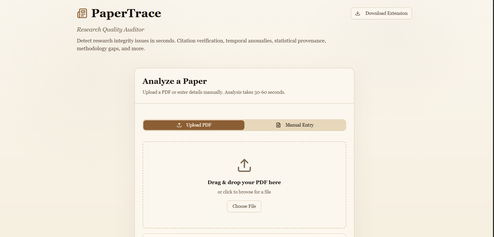
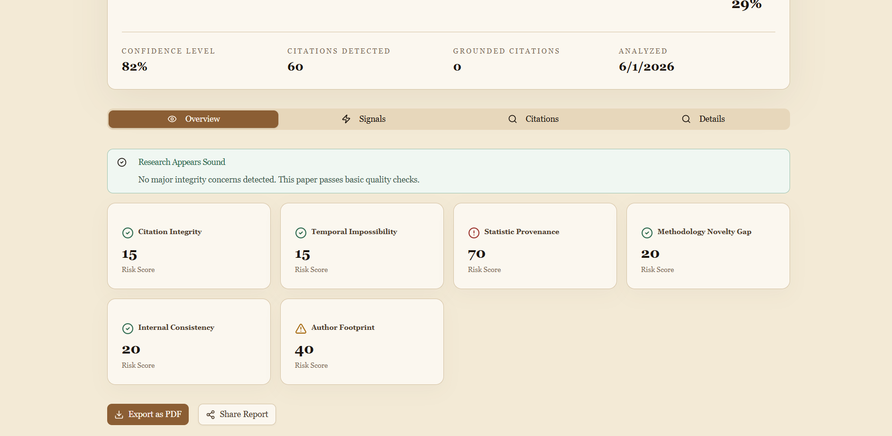
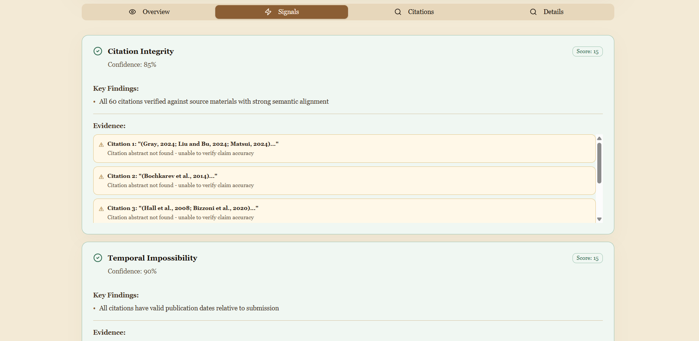
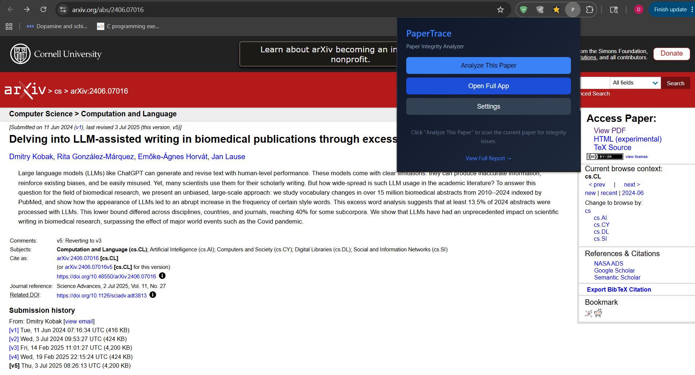

# PaperTrace

PaperTrace is a research-paper analysis tool that checks citation grounding, temporal consistency, numeric provenance, methodology alignment, and related integrity signals across uploaded PDFs, manually entered papers, and supported academic websites through a browser extension.

**Why PaperTrace**

There are far more papers published today than any single reader can reasonably evaluate. Much of that volume is noise: papers produced to exist rather than to advance reliable knowledge — poorly grounded citations, unreproducible results, and claims unsupported by their data. PaperTrace is not an "AI detector." It is a research-quality auditor: it surfaces citation grounding, numeric and methodological provenance, timeline and consistency checks, and other integrity signals so you can see which papers matter and why. In short, PaperTrace makes it expensive to hide hollow science.

It has three main parts:

- a **Next.js web app** for upload, parsing, analysis, and report viewing
- a **FastAPI backend** for PDF parsing and citation-oriented analysis
- a **Chrome extension** for analyzing papers directly from sites like arXiv and Semantic Scholar

## Screenshots

### Upload screen



### Live analysis pipeline


### Results dashboard




### Signals view



### Extension popup



---

## What PaperTrace does

PaperTrace focuses on evidence-oriented paper review rather than just summary generation.

Core capabilities include:

- **PDF parsing** using PyMuPDF, GROBID-backed parsing, and regex fallback logic
- **Citation-by-citation checking** with source lookup and passage scoring
- **Temporal checks** for impossible or suspicious publication timelines
- **Statistic provenance checks** for numeric claims
- **Method novelty vs. methods alignment** analysis
- **Internal consistency checks** across claims and sections
- **Author and metadata checks** for additional context
- **Extension-based paper intake** from supported research websites

### The six signals PaperTrace reports

PaperTrace currently scores and reports these six primary signals:

1. **Citation Integrity**
	- checks whether cited sources provide retrievable text
	- compares claim language against the best matching source passage
	- uses semantic, keyword, and numeric agreement to score grounding
	- this is the strongest signal in the final score and carries the highest weight
	- current scoring weight: **30%**

2. **Temporal Impossibility**
	- checks whether cited works appear to be published after the paper year
	- flags suspicious or impossible citation timelines
	- current scoring weight: **20%**

3. **Statistic Provenance**
	- extracts numeric claims from the paper
	- checks whether source material supports the reported numbers or nearby evidence
	- current scoring weight: **20%**

4. **Methodology Novelty Gap**
	- compares novelty claims against the methods section
	- flags cases where the paper claims novelty but the implementation evidence is weak or missing
	- current scoring weight: **15%**

5. **Internal Consistency**
	- looks for contradictions, unsupported repetition patterns, and unstable claims across the paper
	- current scoring weight: **10%**

6. **Author Footprint**
	- uses author and metadata context to surface suspicious or weak authorship-related signals
	- current scoring weight: **5%**

In practice, this means PaperTrace emphasizes evidence-backed citation behavior first, then publication timeline and numeric support, followed by methodology alignment, internal consistency, and author-context cues.

---

## Current architecture

### 1. Web app

- Framework: **Next.js 16**
- UI: **React 19 + shadcn/ui + Tailwind**
- Main entry: `app/page.tsx`
- Primary API routes:
  - `app/api/analyze/route.ts`
  - `app/api/parse-pdf/route.ts`

The web app provides:

- PDF upload and manual entry
- progress/pipeline display
- results dashboard
- downloadable extension package from `public/papertrace-extension.zip`

### 2. Backend

- Framework: **FastAPI**
- Main file: `backend/main.py`
- Parsing and retrieval logic: `backend/services.py`
- Embedding utilities: `backend/embeddings.py`

The backend is responsible for:

- parsing uploaded PDFs
- parsing PDFs from remote `pdfUrl` values
- running citation integrity and related analysis
- retrieving candidate source text from external scholarly sources

### 3. Extension

- Manifest version: **MV3**
- Folder: `extension/`
- Main files:
  - `manifest.json`
  - `content.js`
  - `popup.js`
  - `background.js`
  - `options.html` / `options.js`

The extension can:

- extract paper metadata from supported sites
- analyze through the backend/API
- open the full PaperTrace app
- route PDF-linked papers into PDF parsing flow

---

## High-level request flow

### Web app PDF flow

```text
User uploads PDF
	↓
Next API: /api/parse-pdf
	↓
FastAPI backend: /parse-pdf or /parse-pdf-url
	↓
Parsed paper + citations returned
	↓
Next API: /api/analyze
	↓
FastAPI backend: /analyze
	↓
Results dashboard
```

### Extension flow

```text
User opens supported paper page
	↓
Extension content script extracts metadata / identifiers
	↓
If PDF URL exists:
	parse PDF flow is used
Else:
	metadata-only analyze flow is used
	↓
Backend/API response
	↓
Popup summary or full app handoff
```

---

## Repository structure

```text
PaperTrace/
├── app/
│   ├── api/
│   │   ├── analyze/route.ts
│   │   └── parse-pdf/route.ts
│   ├── globals.css
│   ├── layout.tsx
│   └── page.tsx
├── backend/
│   ├── .env.example
│   ├── embeddings.py
│   ├── main.py
│   ├── requirements.txt
│   └── services.py
├── components/
│   ├── AnalysisPipeline.tsx
│   ├── PaperUpload.tsx
│   ├── ResultsDashboard.tsx
│   └── ui/
├── extension/
│   ├── background.js
│   ├── content.js
│   ├── manifest.json
│   ├── options.html
│   ├── options.js
│   ├── popup.html
│   └── popup.js
├── lib/
│   └── detectionEngine.ts
├── public/
│   └── papertrace-extension.zip
└── package.json
```

---

## Local development

### Prerequisites

- Node.js 18+
- Python 3.11 recommended
- pip

### Install frontend dependencies

From the repo root:

```bash
npm install
```

### Install backend dependencies

From the repo root:

```bash
pip install -r backend/requirements.txt
```

### Run the frontend

```bash
npm run dev
```

Frontend runs at:

```text
http://localhost:3000
```

### Run the backend

```bash
npm run start:backend
```

Backend runs at:

```text
http://127.0.0.1:8000
```

### Local environment files

Backend env lives in:

```text
backend/.env
```

Frontend local env can be placed in:

```text
.env.local
```

Useful frontend env:

```dotenv
PAPERTRACE_BACKEND=http://localhost:8000
```

---

## Backend environment variables

Common backend environment variables:

```dotenv
SEMANTIC_SCHOLAR_API_KEY=
UNPAYWALL_EMAIL=
GROBID_URL=https://kermitt2-grobid.hf.space
GROBID_FALLBACK_URLS=https://cloud.science-miner.com/grobid
OPENAI_API_KEY=
OPENAI_MODEL=gpt-4o-mini
OPENAI_BASE_URL=https://api.openai.com/v1
LOG_LEVEL=INFO
```

Notes:

- Render supplies `PORT` automatically; do not hardcode it there.
- Local development can still use `PORT=8000` if needed.

---

## Loading the extension locally

The extension does not require a separate build step for development.

### Load unpacked extension

1. Open `chrome://extensions`
2. Enable **Developer mode**
3. Click **Load unpacked**
4. Select:

```text
PaperTrace/extension
```

### Extension settings

The extension has two important settings:

- **PaperTrace App URL**
- **API Endpoint URL**

Recommended values:

#### Local frontend + local backend

```text
PaperTrace App URL: http://localhost:3000
API Endpoint URL: https://papertrace-1.onrender.com/analyze
```

Why this still works locally:

- the extension now defaults to the deployed backend for production
- but when a local backend is reachable, it automatically prefers localhost at runtime
- the web app also prefers local backend when the frontend request originates from localhost

#### Deployed usage

```text
PaperTrace App URL: <your deployed frontend>
API Endpoint URL: https://papertrace-1.onrender.com/analyze
```

---

## Packaging the extension

The repository includes a packaged zip at:

```text
public/papertrace-extension.zip
```

This is served by the web app and linked from the main UI.

If extension files change, regenerate the zip before shipping or redeploying the frontend.

---

## API routes

### Next.js API routes

#### `POST /api/parse-pdf`

Accepts either:

- uploaded PDF form data
- JSON with a `pdfUrl`

Then forwards parsing work to the backend.

#### `POST /api/analyze`

Accepts parsed or manually entered paper data and forwards it to the backend analysis pipeline.

The route is environment-aware:

- when the frontend request comes from localhost, local backend candidates are preferred first
- when deployed, the configured deployed backend is preferred first

### FastAPI backend routes

#### `GET /`
Basic service status.

#### `GET /healthz`
Health check with lightweight backend status data.

#### `POST /parse-pdf`
Parses uploaded PDF files.

#### `POST /parse-pdf-url`
Fetches and parses a PDF from a remote `pdfUrl`.

#### `POST /analyze`
Runs the full analysis pipeline and returns a structured report.

---

## Deployment

## Backend deployment (Render)

Recommended:

- Service type: **Python Web Service**
- Root directory: `backend`
- Python version: **3.11**

### Build command

If root directory is `backend`:

```bash
pip install -r requirements.txt
```

If root directory is repo root:

```bash
pip install -r backend/requirements.txt
```

### Start command

If root directory is `backend`:

```bash
uvicorn main:app --host 0.0.0.0 --port $PORT
```

If root directory is repo root:

```bash
uvicorn main:app --host 0.0.0.0 --port $PORT --app-dir backend
```

### Render environment variables

Typical values:

```dotenv
PYTHON_VERSION=3.11.11
SEMANTIC_SCHOLAR_API_KEY=
UNPAYWALL_EMAIL=
GROBID_URL=https://kermitt2-grobid.hf.space
GROBID_FALLBACK_URLS=https://cloud.science-miner.com/grobid
OPENAI_API_KEY=
OPENAI_MODEL=gpt-4o-mini
LOG_LEVEL=INFO
```

## Frontend deployment (Vercel)

### Vercel settings

- Framework preset: **Next.js**
- Install command:

```bash
npm install
```

- Build command:

```bash
npm run build
```

- Output directory: default

### Vercel environment variable

```dotenv
PAPERTRACE_BACKEND=https://papertrace-1.onrender.com
```

---

## Logging and diagnostics

The backend now logs:

- request start and completion
- request duration
- parse endpoint usage
- analyze endpoint usage
- health checks
- source-retrieval fallback activity

Useful local checks:

```text
http://127.0.0.1:8000/
http://127.0.0.1:8000/healthz
```

When running both frontend and backend locally, watch both terminals:

- `npm run dev` for Next.js route usage and backend candidate selection
- `npm run start:backend` for actual backend request logs

---

## Known notes

- The frontend may show long-running `/api/analyze` requests because the backend pipeline can take time depending on PDF size, citation count, and source lookup.
- PDF parsing quality depends on the source PDF and external GROBID availability.
- The extension supports a defined set of academic websites and relies on metadata extraction from those pages.
- The backend prefers real source text when available and falls back through multiple scholarly providers before returning an unverifiable citation result.

---

## Scripts

From the repo root:

```bash
npm run dev            # start Next.js frontend
npm run start:backend  # start FastAPI backend with reload
npm run build          # production frontend build
npm start              # start built frontend
npm run lint           # lint frontend code
```

---

## Security notes

- Keep API keys in environment variables only.
- Rotate any key that has been exposed in screenshots, chat logs, or committed files.
- Do not commit private `.env` values.

